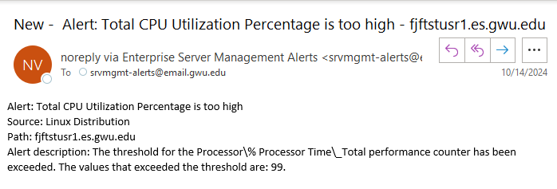
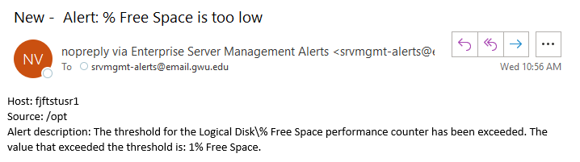
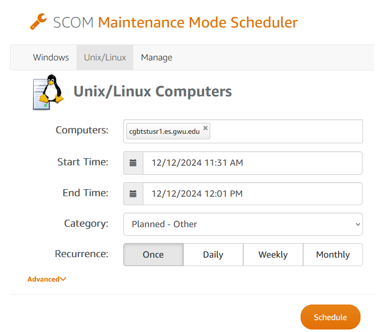

# PCC: Server Administration
# Monitoring Consolidation
#### (no more nagios)
---
## When ?
- January 14th, 2025

## Why ?
- Common monitoring process for all servers
- One less tool to manage
- Nagios costs money, now it won't

---
## What's Changing ? (Email Formatting)

- Email Formatting

---
## What's Changing ? (Maintenance Mode)
- self service
- mutes alerts for a specified time

---
## What's Changing ? (Maint. Mode cont'd)

- [Maintenance Mode for Linux](https://scom.it.gwu.edu/MM/Home/Unix)
- adm credentials required to access scheduler console
- access restricted to GW IP

---
## Links
- [This Presentation](https://github.com/gwit-esd-pcc-serveradministration/esm_monitoring_consolidation.git)
- [OS Teams Consolidation](https://github.com/gwit-esd-pcc-serveradministration/pcc_serveradmin_consolidation_roadshow.git)
---

